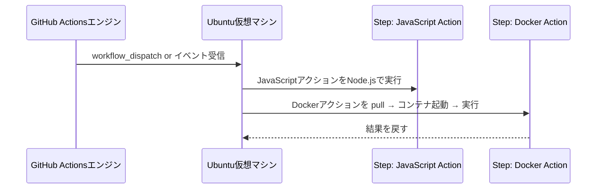

```mermaid
sequenceDiagram
    participant GitHub as GitHub Actionsエンジン
    participant Runner as Ubuntu仮想マシン
    participant Step1 as Step: JavaScript Action
    participant Step2 as Step: Docker Action

    GitHub->>Runner: workflow_dispatch or イベント受信
    Runner->>Step1: JavaScriptアクションをNode.jsで実行
    Runner->>Step2: Dockerアクションを pull → コンテナ起動 → 実行
    Step2-->>Runner: 結果を戻す
```