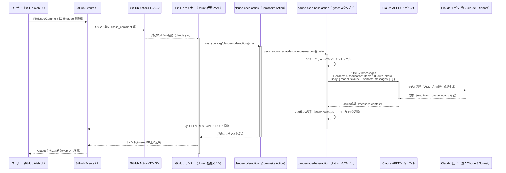

```mermaid
sequenceDiagram
    participant User as ユーザー（GitHub Web UI）
    participant GitHubAPI as GitHub Events API
    participant WFEngine as GitHub Actionsエンジン
    participant Runner as GitHub ランナー（Ubuntu仮想マシン）
    participant CCA as claude-code-action（Composite Action）
    participant CBA as claude-code-base-action（Pythonスクリプト）
    participant ClaudeAPI as Claude APIエンドポイント
    participant ClaudeModel as Claude モデル（例：Claude 3 Sonnet）

    User->>GitHubAPI: PR/Issue/Comment に @claude を投稿
    GitHubAPI-->>WFEngine: イベント発火（issue_comment 等）
    WFEngine-->>Runner: 対応Workflow起動（claude.yml）

    activate Runner
    Runner->>CCA: uses: your-org/claude-code-action@main
    activate CCA
    CCA->>CBA: uses: your-org/claude-code-base-action@main
    activate CBA

    CBA->>CBA: イベントPayloadからプロンプトを生成
    CBA->>ClaudeAPI: POST /v1/messages<br>Headers: Authorization: Bearer <OAuthToken><br>Body: { model: "claude-3-sonnet", messages: [...] }
    activate ClaudeAPI
    ClaudeAPI->>ClaudeModel: モデル処理（プロンプト解析・応答生成）
    ClaudeModel-->>ClaudeAPI: 応答（text, finish_reason, usage など）
    deactivate ClaudeAPI
    ClaudeAPI-->>CBA: JSON応答（message.content）

    CBA->>CBA: レスポンス整形（Markdown対応、コードブロック処理）
    CBA->>GitHubAPI: gh CLI or REST APIでコメント投稿
    deactivate CBA
    CCA-->>Runner: 成功レスポンスを返却
    deactivate CCA
    Runner-->>GitHubAPI: コメントがIssue/PR上に反映
    GitHubAPI-->>User: Claudeからの応答をWeb UIで確認
    deactivate Runner
```