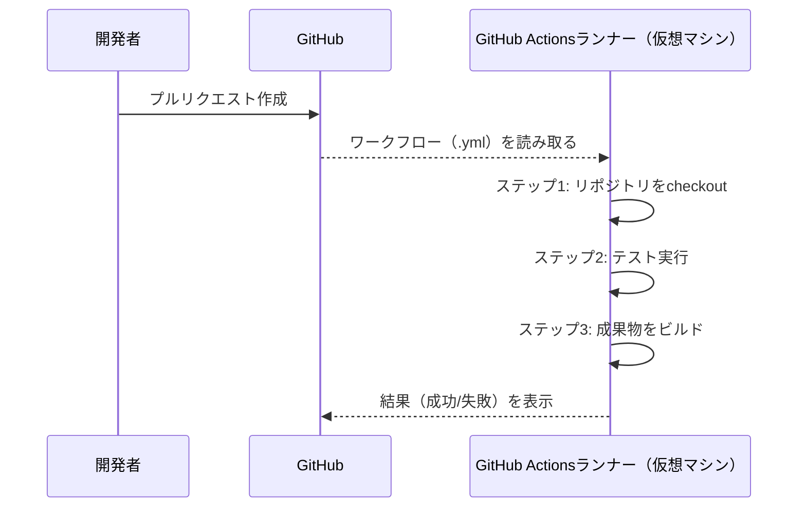

```mermaid
sequenceDiagram
    participant Dev as 開発者
    participant GitHub as GitHub
    participant Runner as GitHub Actionsランナー（仮想マシン）

    Dev->>GitHub: プルリクエスト作成
    GitHub-->>Runner: ワークフロー（.yml）を読み取る
    Runner->>Runner: ステップ1: リポジトリをcheckout
    Runner->>Runner: ステップ2: テスト実行
    Runner->>Runner: ステップ3: 成果物をビルド
    Runner-->>GitHub: 結果（成功/失敗）を表示
```