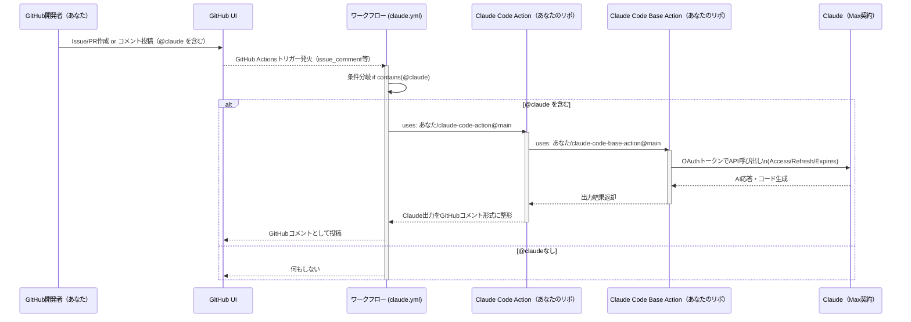

```mermaid
sequenceDiagram
    participant Dev as GitHub開発者（あなた）
    participant UI as GitHub UI
    participant WF as ワークフロー (claude.yml)
    participant CCA as Claude Code Action（あなたのリポ）
    participant CBA as Claude Code Base Action（あなたのリポ）
    participant Claude as Claude（Max契約）
    
    Dev->>UI: Issue/PR作成 or コメント投稿（@claude を含む）
    UI-->>WF: GitHub Actionsトリガー発火（issue_comment等）

    activate WF
    WF->>WF: 条件分岐 if contains(@claude)
    alt @claude を含む
        WF->>CCA: uses: あなた/claude-code-action@main
        
        activate CCA
        CCA->>CBA: uses: あなた/claude-code-base-action@main
        activate CBA
        
        CBA->>Claude: OAuthトークンでAPI呼び出し\n(Access/Refresh/Expires)
        Claude-->>CBA: AI応答・コード生成
        
        CBA-->>CCA: 出力結果返却
        deactivate CBA
        CCA-->>WF: Claude出力をGitHubコメント形式に整形
        deactivate CCA
        WF-->>UI: GitHubコメントとして投稿
    else @claudeなし
        WF-->>UI: 何もしない
    end
    deactivate WF
```